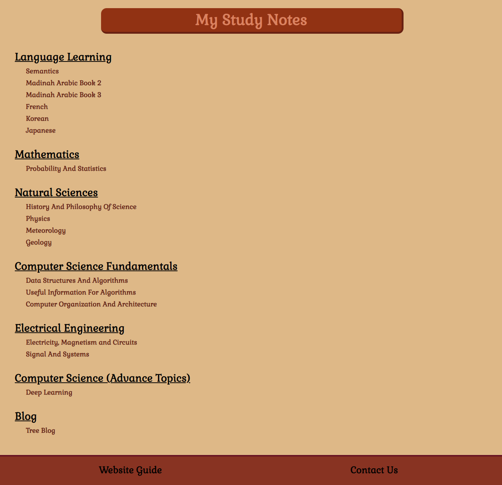
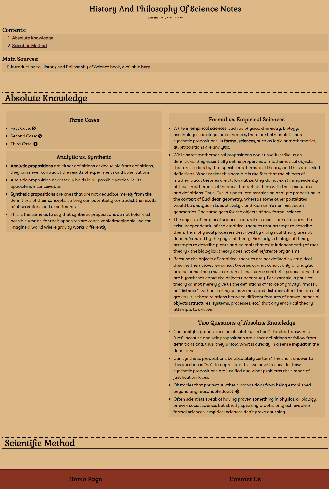
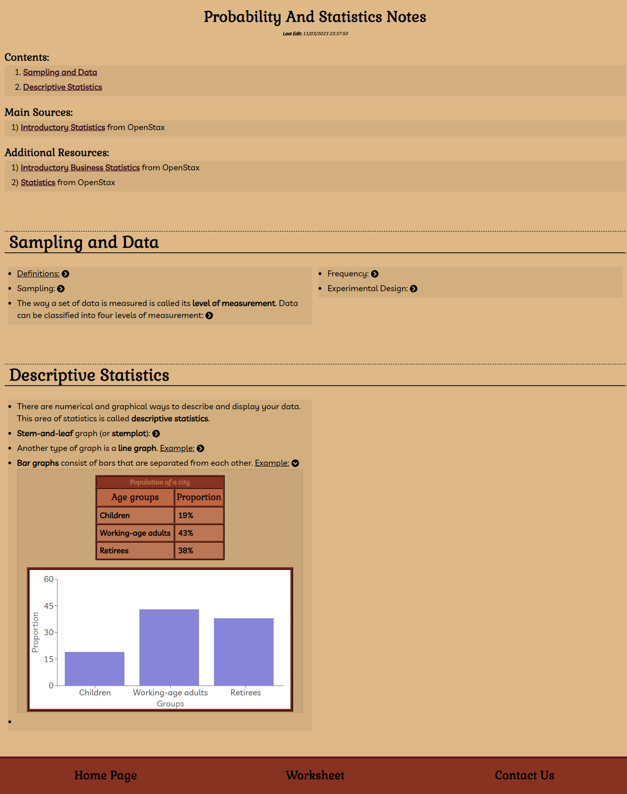
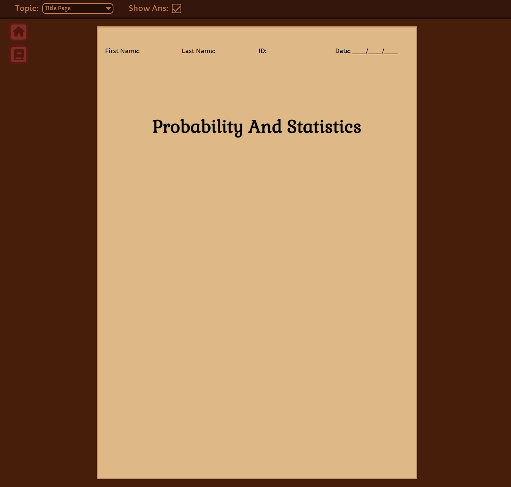
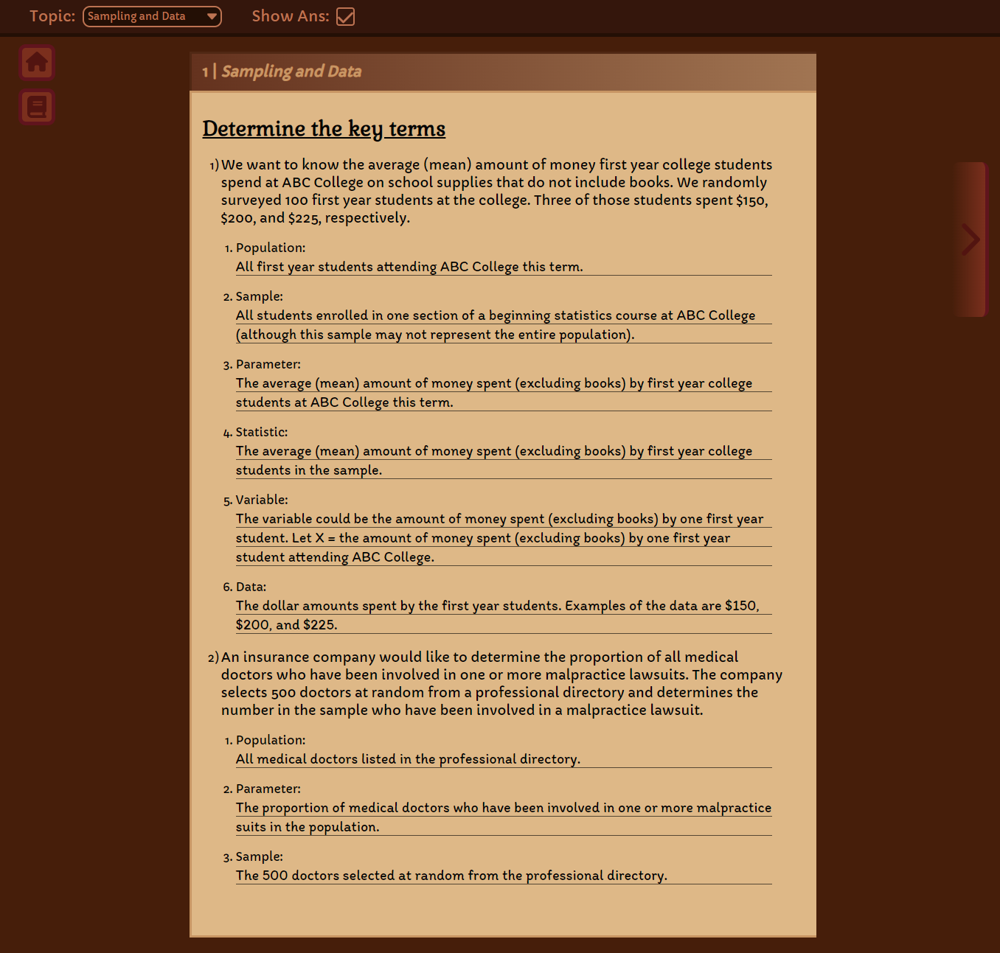

# My Study Notes

This is my first big project that uses React.js and Redux

 

## Basic Use Guide:
- First page (from Home.js [1]) will show all the topics
- Clicking on one of the topics will send you to it's study note (from Article.js [2])
- Some study notes may have a worksheet link in the footer, clicking on it will send you to a built-in worksheet page (from Worksheet.js [3])

<table><tbody>
	<tr>
		<td>[1] First page screenshot:  </td>
	</tr>
	<tr>
		<td>
			[2] Study notes page screenshots:  
			
			
		</td>
	</tr>
	<tr><td>
		[3] Worksheet screenshots:  
		
		
	</td></tr>
</tbody></table>

## Updates:

Versioning is done using "npm version [new-version] --git-tag-version false"

update 19.55 - 19.71:
- Added more content and made changes to `calculus.js`.
  
update 19.42 - 19.54:
- Added more content and made changes to `number_theory.js` and `calculus.js`.

update 19.10 - 19.41:
- Added more content and made changes to `calculus.js`.

update 19.9:
- Added content to `precalculus.js`.
- Added another source in `calculus.js`.

update 19.8:
- Fixed horizontal overflow issue at the home page for mobile.
- Made styling changes for the contact form and the color boxes in sources list.

update 19.6 - 19.7:
- Made changes to `number_theory.js`.

update 19.5:
- Made changes to `data_structures_and_algorithm.js`, `calculus.js`, `numbert_theory.js` and `precalculus.js`.
- Removed the `lastSavedScrollY` static variable from `Article.js`.
- `#DownButton` now disappears when you are 800px pixels below the bottom of the page but becomes visible again if you open a long sublist.

update 19.4:
- Made coding style changes to `Article.js`.
- Added REMOVE tag to some sources in `sourceList.js`.
- Added `saved_resources.js` and `c_programming_language.js`.
- Added `operating_systems.js` (this was private before).
- Made changes to `japanese.js` and `korean.js`.

update 19.3:
- Updated `cryptography.js`, `information_and_entropy.js`, `number_theory.js`, `precalculus.js` and `calculus.js`.
- Precalculus pictures now have a different folder.
   
update 19.2:
- `cryptography` is now an advanced topic.
- removed `opearting systems`
- The `listsUpButton` button now disappears when viewing an image.
- Updated `cryptography.js`, `number_theory.js` and `probability_and_Statistics.js`.

update 19.1:
- Added a "Close all lists" button.
- Added `networking.js` and `information_and_entropy.js`.
- Made changes to `guide.js`, `number_theory.js` and `calculus.js`.

update 18.2 - 18.5:
- `Questions` component dialog box is now closed by default.

update 18.1:
- Added `Questions` component.
- Added content to `number_theory` and `information_and_entropy`.
- In `Article.js`, date is now in the `SMALL` tag.
- Made some changes to the License section at home page.

update 17.17 - 17.20:
- In `Article.js`, two states are now defined, one for footer and the other for `wholeContent`.

update 17.3 - 17.16:
- In `Worksheet.js`, the `import` function is used instead of `require`.

update 17.2:
- In `Article.js`, the `import` function is used instead of `require`.

update 16.3 (or 17.1):
- The article date below H1 is deleted from all files and is now automatically placed below H1 after the article is mounted.
- Added `chemistry.js`

update 16.1 - 16.2:
- Github pages is no longer used, now the website is hosted on Vercel.

update 15.7:
- Added code was excluding private files, and made changes to `calculus.js` and `number_theory.js`. Also added `manim.js`.

update 15.6:
- Hovering mouse on the article would now show the source.

update 15.5:
- Added `precalculus.js` and changed the content of `calculus.js`.

update 15.4:
- Added content to `french.js`.

update 15.3:
- Added content to `probability_and_statics.js`.

update 15.2:
- Added a license box in the home page which shows the website license.

update 15.1:
- Added a contact form

update 14.10:
- Added `information_and_entropy.js`.
- The `public` and `src` folders are now shows in GitHub.

update 14.8 - 14.9:
- In `article.js`, anchors in the sources section now have target="_blank".
- When directly using any url other the the base url, github would redirect to 404.html, to fix this I changed my 404.html (using this article https://github.com/rafgraph/spa-github-pages).

update 14.7:
- In `article.js`, the `this.getReferenceEl` needs only H2 elements as input.

update 14.2 - 14.6:
- 404 now redirects to home page.

update 14.1:
- Added `calculus.js`, `calculus_pics`, `data_mining.js`, `data_mining_pics`, `4412pics` and `data_mining_with_r.js`.
- Links in the "Contents" section used to open in a new tab, now they don't.
- Hovering on the left and right side of an overflowing table would now horizontally scroll it.
- Added mobile-specific styles.
- MathJax components are now static instead of relative.
- In ordered sublists: images, figures and charts weren't suppose to show the number marker, so that's fixed now.

update 13.3 - 13.5:
- These commits are for testing. Made some bug fixes during these commits.

update 13.2:
- Horizontal scroll was not showing when window was less than min-width, so that's fixed now.

update 13.1:
- Renamed repository to `studyNotes`.

update 12.1:
- Added `number_theory.js`.

update 11.5:
- Added more content to `deep_learning.js`
- `CodePre` now trims from both start and end.

update 11.4:
- Added more content to `deep_learning.js`

update 11.3:
- Added content to `probability_and_statistics.js`
- Added `SubDiv.js` which can hold is a child of UL or OL and can hold multiple UL or OL
- Added `ownExplanation` class for UL and OL which is for my own explanations

update 11.2:
- In `Article.js`, the functions in `componentDidMount` wrapped in `window.setTimeout`
- Added `%PUBLIC_URL%` to `404.html` because the logo and font weren't displaying
- Made changes in `Worksheet.js`:
	- Some of the dynamic DOM manipulation happens via React features, instead of directly through JQuery.

update 11.1:
- Made changes to `korean.js`
- Made changes to `404.html`, so it shows the loading screen before going to home page
- Added `Redux`, so now global states are being used to reduce direct DOM manipulation
	- For now, `Redux` is only being used for `ImgView`

update 10.1:
- Removed `[target = "_blank"]` from anchors
- Removed `#main` from `worksheet.scss`
- Made changes to `data_structure_and_algorithms.js` to display the correct colors
- Made changes to `computer_organization_and_architecture.js` so `h2`'s now have an id
- `Articles.js` now uses separate functions to render footer and `#reference`
- Made changes to `ImgView` component so contents are displayed properly
- Added `TableComp` component which will be used to manage tables

update 9.4:
- All pages now get their sources list from the sources "database". Actual db will be implemented later.
- Edited the 404 page.
- Made minor changes to the loading screen file.

update 9.3:
- Made minor changes to `README.md`

update 9.2:
- Added website screenshots to `README.md`
- Made minor changes to webpages

update 9.1:
- Added `ImgComp`, which is used as a wrapper for the `IMG` tag with added functionality.
- Added `Mathstuff`, a component to handle "non-inline" MathJax.
- I had to edit every page to implement this 😔, but I added a python code that could edit file lines to make my life easier.
- Added `ImgView` component that shows a larger version of images, `MathStuff` and charts.

update 8.1:
- Reworked the entire code of the worksheet component to improve loading time.

